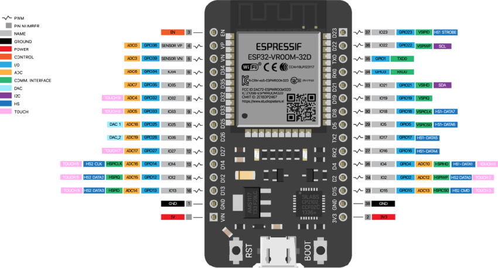

# ECG Data Acquisition and Transmission using ESP32 and ADS8232

## Table of Contents

- [Introduction](#introduction)
- [Features](#features)
- [Getting Started](#getting-started)
  - [Hardware Setup](#hardware-setup)
  - [Software Setup](#software-setup)
- [Usage](#usage)
- [License](#license)

## Introduction

Welcome to the ECG Data Acquisition and Transmission project! This open-source endeavor showcases a fascinating intersection of technology and healthcare, utilizing the ADS8232 chip and ESP32 microcontroller to acquire Electrocardiogram (ECG) data and transmit it via Bluetooth Low Energy (BLE).

**Please Note:** This project is intended solely for educational purposes and is **NOT** intended for medical use.

## Features

- ECG data acquisition with ADS8232
- Data transmission using serial over BLE with ESP32
- Real-time data visualization with Bluefruit Connect app ([iOS](https://apps.apple.com/us/app/adafruit-bluefruit-le-connect/id830125974) and [Android](https://play.google.com/store/apps/details?id=com.adafruit.bluefruit.le.connect))
- Moving Average filter to remove baseline wander
- FIR filter to remove 50Hz noise (Powerline Noise in my country) from ECG signal

## Getting Started

This project uses PlatformIO to manage dependencies and build the project. Follow the instructions to install PlatformIO on your preferred IDE on their website [here](https://platformio.org).

### Hardware Setup

Hardware required for this project:

1. ESP-WROOM-32

2. ADS8232 ECG acquisition module [https://www.sparkfun.com/products/12650](https://github.com/sparkfun/AD8232_Heart_Rate_Monitor)

Connect the ESP32 and ADS8232 as follows:

| ESP32 | ADS8232 |
| ----- | ------- |
| 3V3   | 3.3V    |
| GND   | GND     |
| 4     | OUTPUT  |
| 16    | LOFF-   |
| 17    | LOFF+   |

### Software Setup

Guide users through the software setup process:

1. Clone this repository: `git clone https://github.com/dannyngweekiat/esp32-serial-BLE-ECG`
2. Open the project in your preferred IDE.
3. Build the project
4. Upload the code to your ESP32.

## Usage

Open the Bluefruit Connect app and connect to the ESP32. Select the Plotter option to start receiving data from the ECG module.

## License

Distributed under the MIT License. See [LICENSE](/LICENSE) for more information.
